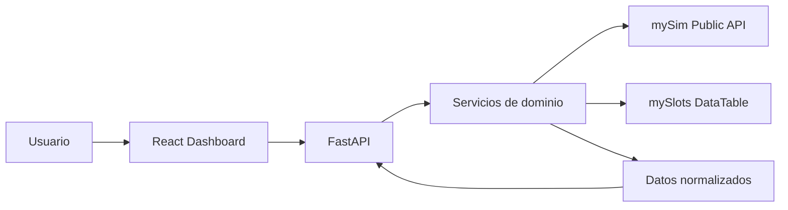
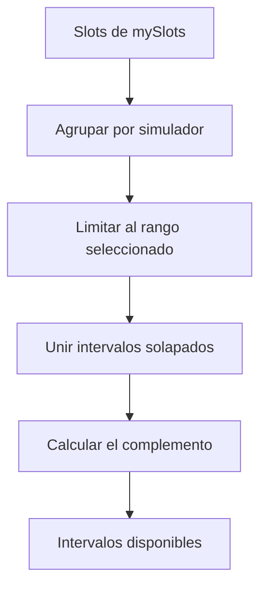
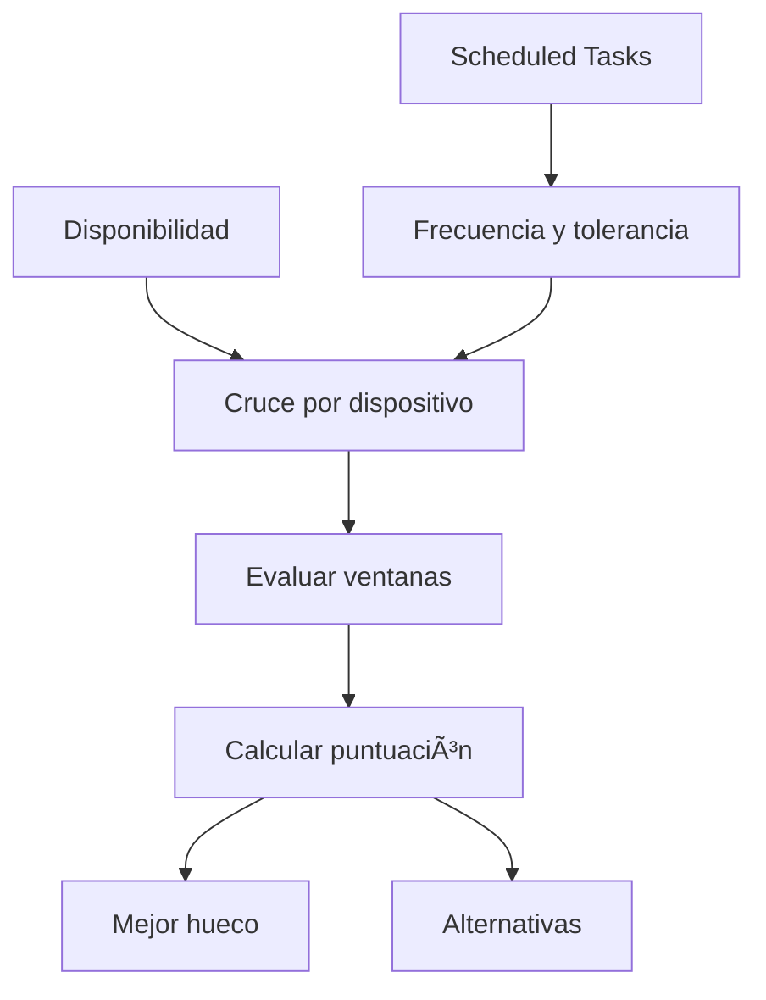

<div align="center">

# ✈️ mySim Operations Dashboard

### Maintenance & Support · Simulation Engineering

**Panel operativo para centralizar el mantenimiento, la disponibilidad y el estado de los simuladores.**

<br>


<br>

[Visión general](#-visión-general) ·
[Funcionalidades](#-funcionalidades) ·
[Arquitectura](#-arquitectura) ·
[Instalación](#-puesta-en-marcha) ·
[API](#-api-disponible)

---

</div>

## 🎯 Visión general

**mySim Operations Dashboard** transforma los datos operativos de **mySim** y **mySlots** en una interfaz visual, clara y accionable.

El sistema permite consultar desde un único lugar:

* Disponibilidad de los simuladores.
* Trabajos de mantenimiento abiertos o vencidos.
* Discrepancy Reports abiertos.
* Acciones pendientes o en curso.
* Tareas programadas y sus tolerancias.
* Recomendaciones para aprovechar los huecos libres.

El backend consulta, limpia, normaliza y relaciona la información procedente de mySim. El frontend organiza los resultados por simulador mediante tarjetas, filtros, carruseles y modales de detalle.

> [!NOTE]
> El dashboard funciona como herramienta de consulta y apoyo a la planificación.
> **mySim continúa siendo la fuente de verdad de los datos operativos.**

## 🚀 Funcionalidades

<table>
  <tr>
    <td width="33%" valign="top">
      <h3>📅 Availability</h3>
      Calcula los intervalos ocupados y disponibles de cada simulador dentro del rango seleccionado.
    </td>
    <td width="33%" valign="top">
      <h3>✨ Recommendations</h3>
      Cruza disponibilidad, fechas planificadas y tolerancias para encontrar los mejores huecos de mantenimiento.
    </td>
    <td width="33%" valign="top">
      <h3>💼 Jobs</h3>
      Separa los trabajos abiertos, próximos a vencer y vencidos, mostrando prioridad y urgencia.
    </td>
  </tr>
  <tr>
    <td width="33%" valign="top">
      <h3>⚠️ DRs</h3>
      Agrupa los Discrepancy Reports abiertos por dispositivo y muestra su información técnica.
    </td>
    <td width="33%" valign="top">
      <h3>✅ Actions</h3>
      Presenta las acciones abiertas o en curso junto con su responsable, turno y fecha.
    </td>
    <td width="33%" valign="top">
      <h3>🕒 Tasks</h3>
      Enriquece las tareas programadas con su frecuencia, estado y ventana de tolerancia.
    </td>
  </tr>
</table>

### Simuladores FFS principales

El dashboard identifica, ordena y representa visualmente los siguientes simuladores:

* A400M
* A330 MRTT
* C295 TS03
* C295 EA03
* CN235

También se conservan y muestran otras familias de dispositivos como FTD, MPRS, IPTS, CMOS, LMWS, CHT, DT, GEN y ARMS.

## 🧭 Navegación

| Vista            | Contenido                                               |
| ---------------- | ------------------------------------------------------- |
| **Overview**     | Resumen conjunto de DRs, Actions, Tasks y Jobs críticos |
| **Jobs**         | Trabajos abiertos, próximos a vencer y vencidos         |
| **DRs**          | Discrepancias abiertas agrupadas por simulador          |
| **Actions**      | Acciones abiertas o en curso, responsables y turnos     |
| **Tasks**        | Tareas programadas, frecuencias y tolerancias           |
| **Availability** | Huecos disponibles y recomendaciones de mantenimiento   |

## 🔄 Arquitectura



### Flujo de una consulta

1. El usuario accede a una vista del dashboard.
2. React solicita los datos necesarios al backend.
3. FastAPI valida los parámetros recibidos.
4. El servicio correspondiente construye la consulta para mySim.
5. El cliente codifica `extraQuery` en Base64.
6. mySim o mySlots devuelve los registros.
7. El backend limpia, relaciona y normaliza los datos.
8. React agrupa la información por simulador.
9. La interfaz muestra tarjetas, contadores, filtros y detalles.

## 📅 Disponibilidad

El módulo de disponibilidad consulta los Slots existentes en mySlots y calcula el tiempo libre de cada simulador.



El cálculo sigue este proceso:

* Recupera todos los Slots dentro del rango solicitado.
* Pagina los resultados en bloques de 100 registros.
* Agrupa los Slots por simulador.
* Descarta intervalos inválidos.
* Recorta los intervalos a los límites de la consulta.
* Fusiona las ocupaciones que se solapan.
* Calcula los huecos existentes entre ocupaciones.
* Devuelve los minutos totales ocupados y disponibles.

## ✨ Motor de recomendaciones

El sistema relaciona las tareas programadas con los huecos libres de cada simulador.



La puntuación tiene en cuenta:

* Estado de la tarea.
* Frecuencia de mantenimiento.
* Ventana de tolerancia.
* Cercanía al final de la tolerancia.
* Relación con la fecha planificada.
* Duración del hueco libre.
* Capacidad del hueco para albergar la tarea.
* Si la tarea ya se encuentra fuera de tolerancia.

Cada recomendación puede incluir:

* Mejor ventana disponible.
* Ventanas alternativas.
* Puntuación obtenida.
* Motivos que justifican la recomendación.
* Estado de tolerancia en ese hueco.
* Duración disponible.

## ⚡ Optimización de consultas

Para reducir los tiempos de carga, el backend incorpora varias optimizaciones:

* Consultas asíncronas mediante `HTTPX`.
* Máximo de **10 peticiones simultáneas** hacia mySim.
* Caché en memoria para `MaintenanceTask`.
* Caché en memoria para `TaskFrequency`.
* Tiempo de vida de caché de **1 hora**.
* Locks independientes por identificador.
* Reutilización de nombres de dispositivos ya consultados.
* Eliminación de consultas repetidas durante peticiones simultáneas.
* Paginación de los registros de mySlots.
* Carga paralela de los módulos del Overview mediante `Promise.allSettled`.

Los locks evitan que dos peticiones concurrentes consulten el mismo registro mientras todavía se está recuperando.

## 🧱 Stack tecnológico

| Capa              | Tecnología            | Responsabilidad             |
| ----------------- | --------------------- | --------------------------- |
| Frontend          | React 19              | Construcción de la interfaz |
| Lenguaje frontend | TypeScript 6          | Tipado y contratos de datos |
| Bundler           | Vite 8                | Desarrollo y construcción   |
| Componentes       | Airbus UI local       | Sistema visual corporativo  |
| Iconos            | Lucide React          | Iconografía                 |
| Carruseles        | Swiper                | Navegación entre elementos  |
| Backend           | FastAPI               | API y lógica de negocio     |
| Lenguaje backend  | Python 3.12           | Servicios e integración     |
| Validación        | Pydantic              | Modelos y validación        |
| Cliente HTTP      | HTTPX AsyncClient     | Comunicación con mySim      |
| Calidad           | ESLint, Ruff y Pytest | Análisis y pruebas          |

## 🎨 Identidad visual

La interfaz utiliza una librería propia de componentes ubicada en `frontend/src/airbus-ui`.

Incluye:

* Header corporativo.
* Sidebar colapsable.
* Footer común.
* Reloj en tiempo real.
* Tarjetas reutilizables.
* Botones y badges.
* Modales de detalle.
* Tokens de espaciado, sombras y radios.
* Patrón gráfico Carbon Grid.

### Paleta principal

| Color       | Código    | Uso                            |
| ----------- | --------- | ------------------------------ |
| Airbus Blue | `#00205B` | Color principal                |
| Dark Blue   | `#005587` | Fondos y elementos secundarios |
| Medium Blue | `#0085AD` | Estados activos                |
| Light Blue  | `#6399AE` | Textos y bordes                |
| Pale Blue   | `#B7C9D3` | Fondos suaves                  |
| Cyan        | `#00AEC7` | Elementos destacados           |
| Green       | `#84BD00` | Estados correctos              |
| Orange      | `#FE5000` | Avisos                         |
| Red         | `#E4002B` | Errores y vencimientos         |

## 🚀 Puesta en marcha

### Requisitos

* Python 3.12
* Node.js 20.19+, 22.13+ o 24+
* Acceso de red a mySim
* Token de la API pública de mySim
* Usuario y contraseña para Availability y Recommendations

### 1. Clonar el proyecto

```bash
git clone https://github.com/adrcarrui/mysim-dashboard.git
cd mysim-dashboard
```

### 2. Configurar el backend

Desde PowerShell:

```powershell
cd backend

py -3.12 -m venv .venv

.\.venv\Scripts\Activate.ps1

python -m pip install --upgrade pip

pip install -r requirements.txt
```

Crea el archivo `backend/.env`:

```dotenv
MYSIM_BASE_URL=https://itc.simeng.es/api/v1/pub
MYSIM_AUTH_TOKEN=tu_token

MYSIM_USERNAME=tu_usuario
MYSIM_PASSWORD=tu_contraseña

MYSIM_TIMEOUT=20
```

> [!CAUTION]
> No subas el archivo `.env` al repositorio. Está excluido mediante `.gitignore`.

### 3. Configurar el frontend

```powershell
cd ..\frontend

npm ci
```

### 4. Arrancar la aplicación

La forma más rápida en Windows es ejecutar, desde la raíz del proyecto:

```powershell
.\scripts\run_all.bat
```

El script abre dos terminales:

* Backend FastAPI en el puerto `8000`.
* Frontend Vite en el puerto `5173`.

También puedes iniciar cada parte manualmente.

#### Backend

```powershell
cd backend

.\.venv\Scripts\Activate.ps1

uvicorn app.main:app --host 0.0.0.0 --port 8000 --reload
```

#### Frontend

```powershell
cd frontend

npm run dev
```

### URLs locales

| Servicio     | URL                                  |
| ------------ | ------------------------------------ |
| Dashboard    | `http://localhost:5173`              |
| Backend      | `http://localhost:8000`              |
| Swagger UI   | `http://localhost:8000/docs`         |
| OpenAPI      | `http://localhost:8000/openapi.json` |
| Health check | `http://localhost:8000/api/health`   |

## 🔌 API disponible

| Método | Endpoint                                                       | Descripción                  |
| ------ | -------------------------------------------------------------- | ---------------------------- |
| `GET`  | `/api/health`                                                  | Estado y versión del backend |
| `GET`  | `/api/jobs/open`                                               | Jobs abiertos                |
| `GET`  | `/api/jobs/expiring?days=7`                                    | Jobs próximos a vencer       |
| `GET`  | `/api/jobs/overdue`                                            | Jobs vencidos                |
| `GET`  | `/api/drs/open`                                                | DRs abiertos                 |
| `GET`  | `/api/drs/open?device_id={id}`                                 | DRs de un dispositivo        |
| `GET`  | `/api/actions/open`                                            | Actions abiertas             |
| `GET`  | `/api/actions/open?from_date={date}&to_date={date}`            | Actions dentro de un rango   |
| `GET`  | `/api/tasks/upcoming?days=7`                                   | Tareas programadas           |
| `GET`  | `/api/availability?from_date={date}&to_date={date}`            | Disponibilidad               |
| `GET`  | `/api/recommendations?from_date={date}&to_date={date}&limit=5` | Recomendaciones              |

### Ejemplo de consulta

```powershell
Invoke-RestMethod `
  -Uri "http://localhost:8000/api/availability?from_date=2026-09-08&to_date=2026-09-15"
```

### Respuesta de disponibilidad

```json
[
  {
    "deviceId": 123,
    "deviceName": "FFS A400M",
    "totalOccupiedMinutes": 480,
    "totalAvailableMinutes": 960,
    "occupied": [
      {
        "start": "2026-09-08T08:00:00",
        "end": "2026-09-08T16:00:00",
        "durationMinutes": 480
      }
    ],
    "available": [
      {
        "start": "2026-09-08T00:00:00",
        "end": "2026-09-08T08:00:00",
        "durationMinutes": 480
      }
    ]
  }
]
```

## 🗂️ Estructura del proyecto

```text
mysim-dashboard/
├── backend/
│   ├── app/
│   │   ├── api/
│   │   │   ├── actions.py
│   │   │   ├── availability.py
│   │   │   ├── drs.py
│   │   │   ├── health.py
│   │   │   ├── jobs.py
│   │   │   ├── recommendations.py
│   │   │   └── tasks.py
│   │   ├── schemas/
│   │   │   ├── action.py
│   │   │   ├── availability.py
│   │   │   ├── dr.py
│   │   │   ├── job.py
│   │   │   ├── recommendation.py
│   │   │   └── task.py
│   │   ├── services/
│   │   │   ├── actions_service.py
│   │   │   ├── availability_service.py
│   │   │   ├── devices_service.py
│   │   │   ├── drs_service.py
│   │   │   ├── jobs_service.py
│   │   │   ├── mysim_client.py
│   │   │   ├── recommendation_service.py
│   │   │   └── tasks_service.py
│   │   ├── config.py
│   │   └── main.py
│   └── requirements.txt
│
├── frontend/
│   ├── src/
│   │   ├── airbus-ui/
│   │   ├── api/
│   │   ├── assets/
│   │   ├── components/
│   │   ├── layouts/
│   │   ├── pages/
│   │   ├── types/
│   │   ├── App.tsx
│   │
```


